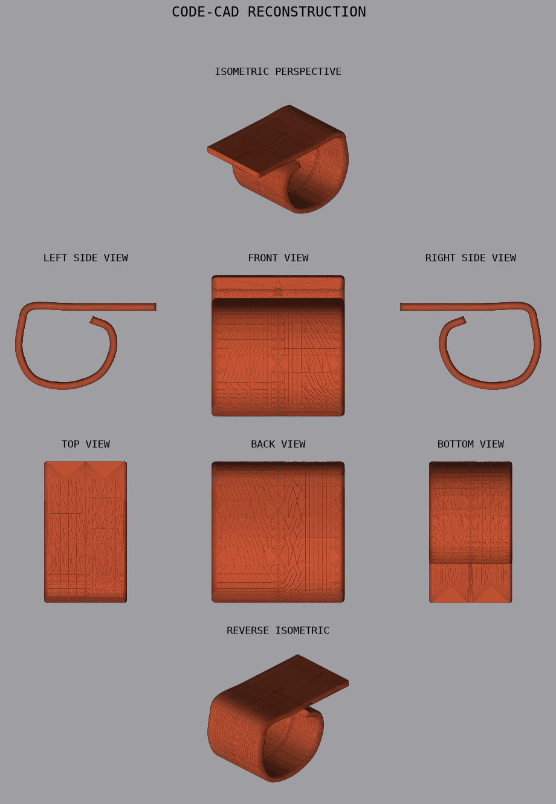

# Curl Stand — Code-CAD Rekonstruktion

Parametrische Rekonstruktion des Objekts aus dem Referenz-Render
("ALL POSSIBLE PERSPECTIVES") mit **Code-CAD**: das LLM schreibt
deterministischen Python-Code (build123d / OpenCASCADE), der direkt nach **STL**
rendert — keine Live-Fernsteuerung von Fusion, kein Session-State. Beschreiben →
Skript → STL → rendern → vergleichen → Variablen anpassen → wiederholen.

Das passt zum Forschungszweig *Text-to-CAD* (vgl. „Text-to-CadQuery", arXiv
2505.06507): Text → Geometrie, deterministisch, versioniert, parametrisch.



## Das Objekt

Ein **Band konstanter Dicke**: es liegt flach auf dem Boden (Basis), steigt
hinten in eine große runde Schlaufe auf, die sich nach vorn einrollt, und die
Lippe legt sich wieder über die Basis. Modellierungsidee:

```
Mittellinien-Spline  ──►  Offset auf Band konstanter Dicke (Face, XZ-Ebene)
                     ──►  über die Breite extrudieren (Y)
                     ──►  Seitenkanten verrunden (Fillet, "Leder"-Look)
                     ──►  mittige Längsnaht abziehen
                     ──►  STL exportieren
```

Das **Seitenprofil ist der einzige Design-Input** — es wird über die Breite
gezogen. Alles ist über Millimeter-Konstanten und die `CTRL`-Kontrollpunkte
parametrisch.

## Dateien

| Datei              | Zweck                                                      |
|--------------------|------------------------------------------------------------|
| `curl_stand.py`    | Parametrisches Modell → `curl_stand.stl`                    |
| `render_views.py`  | Headless 8-Ansichten-Renderer (STL → PNG), kein GL nötig   |
| `curl_stand.stl`   | Exportiertes, wasserdichtes Mesh (~35 cm³, druckbar)       |
| `comparison.png`   | Render-Tafel im Layout der Referenz                        |

## Benutzung

```bash
pip install build123d numpy trimesh matplotlib

python cad/curl_stand.py                 # schreibt cad/curl_stand.stl
python cad/render_views.py cad/curl_stand.stl cad/comparison.png
```

Beispiel-Ausgabe:

```
wrote .../curl_stand.stl
  edge fillet : 1.5 mm
  bbox X,Y,Z  : (78.5, 46.0, 48.8) mm
  material    : 34.8 cm^3
  watertight  : True  (euler=2, faces=89700)
```

## Parameter (oben in `curl_stand.py`)

| Variable        | Bedeutung                                  | Default |
|-----------------|--------------------------------------------|---------|
| `W`             | Breite (Extrusion entlang Y)               | 46 mm   |
| `THICKNESS`     | Banddicke                                  | 4 mm    |
| `EDGE_ROUND`    | Verrundungsradius der Seitenkanten         | 1.5 mm  |
| `GROOVE`        | mittige Längsnaht an/aus                    | True    |
| `GROOVE_W/DEPTH`| Breite / Tiefe der Naht                    | 2.2 / 0.45 mm |
| `CTRL`          | Kontrollpunkte des Seitenprofils (X,Z)     | —       |

Form ändern = `CTRL`-Punkte verschieben und neu rendern. Maße ändern = `W` /
`THICKNESS` anpassen.

## Engineering-Notizen (warum es so gebaut ist)

- **Spline-Profil statt Polygon/Trace.** `trace()` (Sweep-Pen) scheitert an der
  engen Locke; ein Polygon aus hunderten Mini-Segmenten lässt sich nicht
  zuverlässig verrunden. Das Band wird daher als geschlossener Wire aus zwei
  B-Splines (linke/rechte Bandkante) + Stumpf-Kappen gebaut → glatte B-Rep mit
  nur ~20 Kanten → Fillet bei vollem Radius (1.5 mm) möglich.
- **Flache Stumpf-Kappen.** Halbrunde Kappen erzeugen beim Verrunden
  degenerierte Eckflächen, deren STL-Tessellierung Mikro-Lücken hinterlässt
  (nicht wasserdicht). Flache Kappen → **wasserdichtes** Mesh (euler = 2). Die
  Kanten werden trotzdem vom Fillet weich.
- **Adaptives Fillet.** Falls OCCT den Radius an einer Stelle verweigert, fällt
  der Code automatisch auf kleinere Radien zurück, statt abzubrechen.
